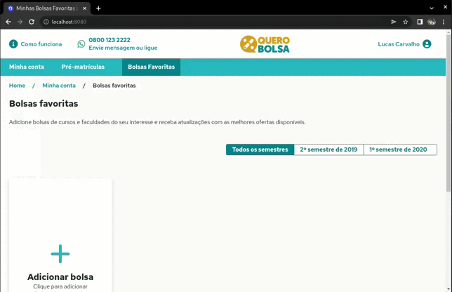

# My Favorite Scholarships

### "My Favorite Scholarships" é uma página do site Querobolsas.com, desenvolvido por mim como um exame prático para a Quero Educação.

### Especificações de funcionalidades:
* O projeto possui uma única página, com a lista de favoritos e um modal para a busca de cursos;
* A clicar em Adicionar curso, deve abrir o modal de busca;
* A busca deve conter os seguintes filtros:
  * Cidade;
  * Curso;
  * Modalidade (Presencial/EaD);
  * Preço;
* A lista de cursos deve ter ordenação por nome da faculdade;
* Múltiplos cursos podem ser selecionados e adicionados à lista de favoritos;
* O botão Adicionar bolsa(s) deve ficar desabilitado enquanto não houver cursos selecionados;
* Os cursos podem ser removidos da lista de favoritos, através do botão Excluir;
* O botão Ver oferta não leva a lugar algum;
* Bolsas com { enabled: false }, devem aparecer com o botão Indisponível;
* A lista de favoritos deve respeitar o semestre selecionado.

### Como executar
* Clone o repositório
* Instale as dependências com `npm install` ou `yarn`
* Inicie a aplicação com Docker executando o comando `npm run serve` ou `yarn serve`
* Ou então inicie a aplicação sem o Docker executando o comando `npm run dev` ou `yarn dev`

### Demonstração

* Layout para desktop: 

    

* Layout mobile:

    

### Deploy:
* A aplicação pode ser conferida através desse link: [my-favorite-scholarships.vercel.app/](https://my-favorite-scholarships.vercel.app/)

### Tecnologias utilizadas:

